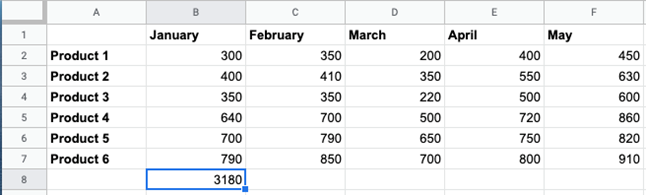
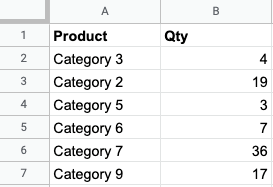
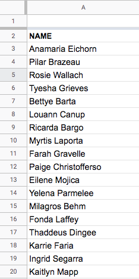
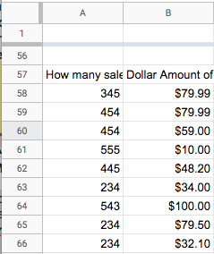
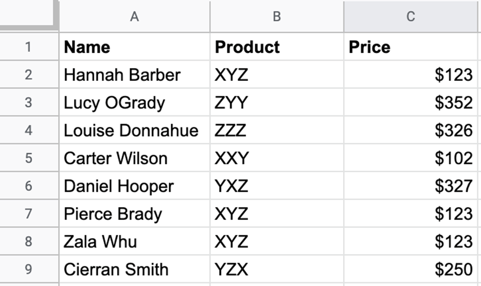
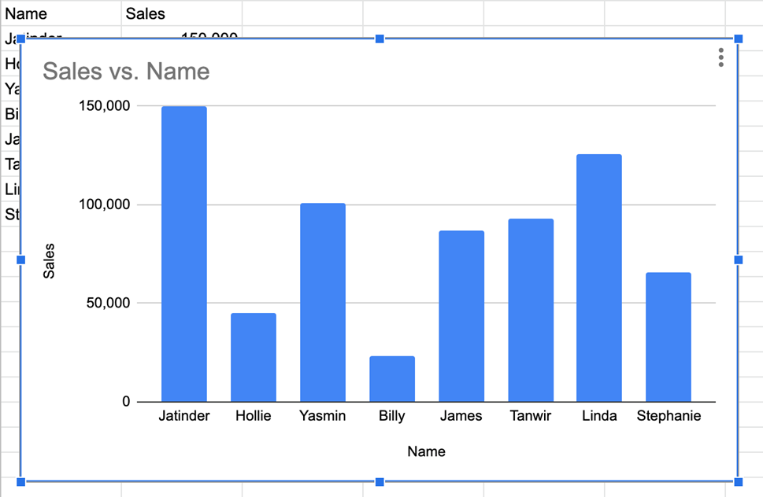

**Question 1**
You have computed the total sales in January and want to apply this formula to the rest of the months. How would you do this?

- [ ] Copy and paste the highlighted cell to each other month
- [ ] Highlight the other cells you want to apply the formula to and press enter
- [ ] You need to input the formula in each cell you want to calculate
- [x] Click and drag the blue box on the bottom of the highlighted cell for the remaining months

**Question 2**

How do you include a group of cells in a function for example, include every cell from B2 to B6?

 - [ ] B2-B6
 - [x] B2:B6
 - [ ] B2=B6
 - [ ] B2/B6

**Question 3**

A function that allows you to apply formatting to certain cells that meet the desired criteria is called:
 - [x] Conditional formatting
 - [ ] Data sorting
 - [ ] Excel filtering
 - [ ]  Index match
 
**Question 4**

What is the easiest way to rearrange these names in this particular column into alphabetical order?

 - [ ]  Rewrite all names into another column and copy across
 - [ ] Highlight all names, click the 'Data' tab in the toolbar and then click 'Sort sheet by column A, A->Z'
 - [x] Highlight all names, click the 'Data' tab in the toolbar and then click 'Sort range by column A, A->Z'
 - [ ] Create a filter and set to alphabetical order
 
**Question 5**

How can you expand column A so that typing isn't over two columns?

 - [ ] Click on cell A57, and enter the formula =expand
 - [ ] Highlight column A, move mouse to the right hand side of column A and then click and drag the column to where all writing is visible
 - [x] Click on cell A57, click and drag the small box in the bottom right hand corner across to the next column to expand
 - [ ] Write the contents of column A across multiple cells

**Question 6**

How would you sort this list so the names are in alphabetical order?

 - [ ] Highlight Column A > Sort > A-Z
 - [ ] Sort > A-Z
 - [ ] You cannot do that, you need to rewrite in alphabetical order
 - [x] Highlight Row 1 > Sort > A-Z

**Question 7**

Which feature would you use to represent numeric data visually?

 - [ ] Excel Slide 
 - [ ] Data layout 
 - [ ] Report 
 - [x] Chart

**Question 8**

You have inserted a chart to compare the number of sales for each salesperson in the team (pictured) but the chart is obscuring the data.  
  
What is the easiest way to move the chart?

 - [x] Click the chart and drag to where you need it in Excel
 - [ ] You cannot move the chart
 - [ ] When inserting the chart, choose which cells you would like it to be in
 - [ ] Delete the chart and start again

**Question 9**

If you had to compare the performance of two sales reps in 2019, what kind of chart would you use?

 - [ ] Pie Chart
 - [ ] Line Chart
 - [x] Column Chart
 - [ ] Dot Graph

**Question 10**

You are reviewing four tenders from potential suppliers and will accept them if the Tender score is 65% or above, as shown in cell E2. What is the formula used in cell C2, which can be copied down to cell C3 through C5, to generate the results shown below?

 - [ ] =IF(B2>=$E$2,"Accept","Reject")
 - [ ] =IF(B2>=E$2,"Accept","Reject")
 - [ ] =IF(B2>=$E2,"Accept","Reject")
 - [x] =IF(B2>=E2,"Accept","Reject")

**Question 11**

You are updating a master spreadsheet for the sales team and want it to automatically update the data in another spreadsheet.  
  
So you don't have to manually update two spreadsheets, how would you do this?

 - [ ] Copy and paste all of the data from one to another 
 - [ ] Link the spreadsheets together
 - [ ] This is not yet an option in Excel
 - [ ] =Copy function as option

**Question 12**

What does 'protect worksheet' do in Excel?

 - [ ] Only allows users with a password to view the sheet
 - [ ] Protects the sheet and cells from being changed or formatted
 - [ ] Hides certain data in the worksheet
 - [ ] You cannot delete the worksheet
